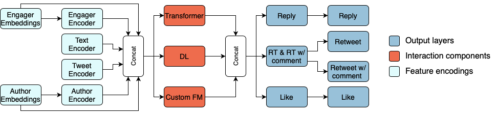

![factored-logo]
# RecSys 2020 Challenge

## Team:
- Juan Manuel Muñoz
- Carlos Miguel Patiño
- Juan Manuel Gutierrez
- Camilo Velasquez
- David R. Valencia

## Data Processing
We prepared the data using the notebooks located in `src/preprocessing/notebooks-emr` using Spark,
and 2 scripts were used to get the topics and the BERT encodings. This process was independent from the rest of the pipeline in Spark.

The notebook order for the preprocessing was:
1. `data-pipeline-final-part2-v0`: The buckets for the users were created.
2. `data-pipelline-emr-final-v0`: Most of the raw data was processed including the creation of labels.
3. `join-bert-code-final-v0`: BERT encodings were joined with the processed data, and some extra features from the BERT like the tweet cluster belonging.
4. `join-topics-final-v0`: Some aggregations per user were done according to the tweet topics seen by each user.
5. `data-pipeline-final-part2-v0`: Buckets 2.0 were calculated looking for improvements
6. `data-pipeline-final-features-v0`: Additional features were calculated and some graph features joined to the processed data.

## Model

Our architecture was based on existing recommender systems that were successful on CTR prediction tasks and is summarized in the image below.

### Training
The training inputs are in the `train_main.py`. The models are located in `src/utils/models.py`.

To execute and train the models run:
`python train_main.py --model_version "50"`

### Tensorboard
To look at the learning curves and the tf info.
`tensorboard --logdir src/models/logs`

[//]: <> (Links and some external resources.)
[factored-logo]: https://static.wixstatic.com/media/1eb931_0cb40fc6adb34750a145518a4e83769b~mv2.png/v1/fill/w_227,h_80,al_c,usm_0.66_1.00_0.01/RGB%20Factored%20Logo.png "factored-logo"